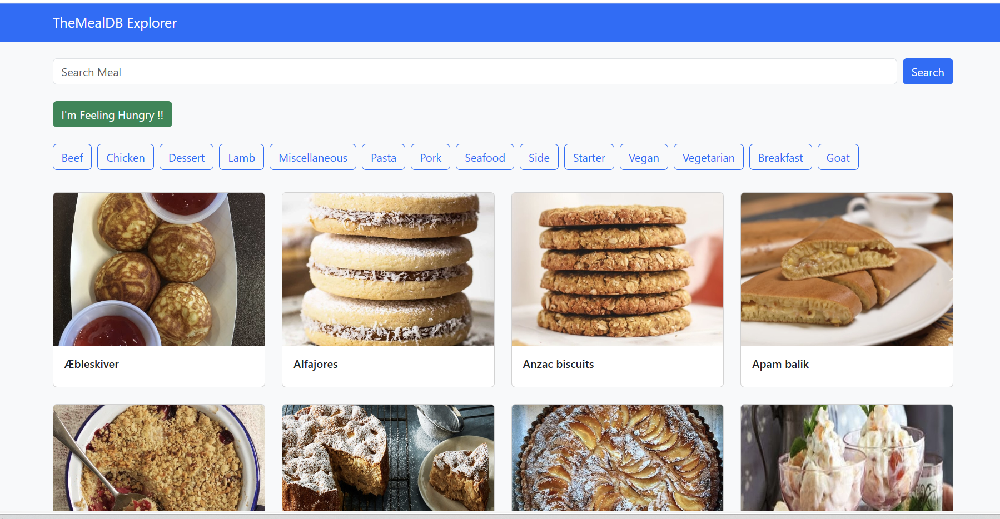
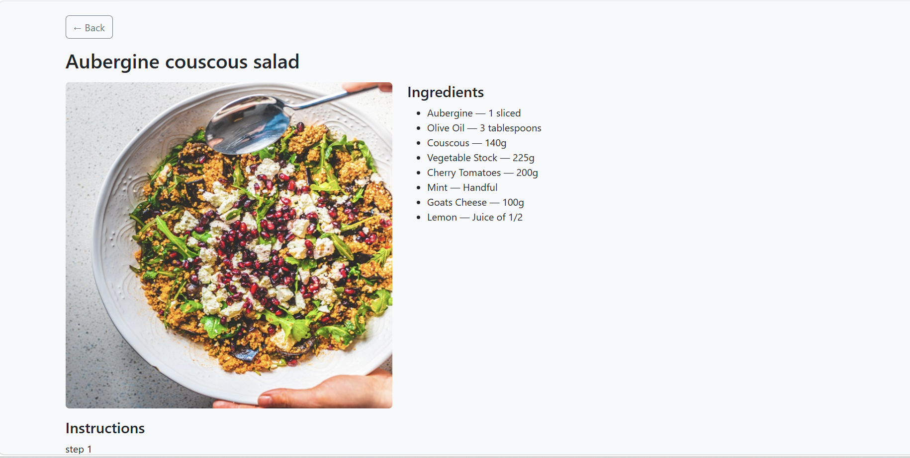
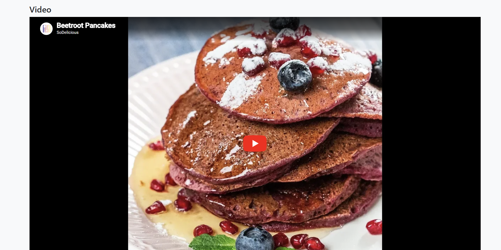

#  TheMealDB Explorer

A small full‑stack app to search, browse and discover recipes, powered by the public
[TheMealDB API](https://www.themealdb.com/api.php).

A **Spring Boot** service wraps TheMealDB behind a few clean REST endpoints (with
in‑memory caching), and a **React + Vite** front end renders the results.

---

##  Features

-  **Search** meals by name
-  **Browse** by category (Chicken, Vegan, Seafood…)
-  **Random meal** — "I'm Feeling Hungry"
-  **Recipe details** — ingredients, instructions & embedded YouTube video
-  **Cached** API responses (10 min TTL, max 100 entries) to stay fast and gentle on the upstream API
-  Responsive layout (Bootstrap)

---

##  Project structure

```
themealdb-explorer/
├── backend/      # Spring Boot REST API (Java 21, Maven)
└── frontend/     # React + Vite single-page app
```

---

##  Prerequisites

- **Java 21** (JDK)
- **Node.js 18+** and npm

---

##  Running locally

The app has two parts — start each in its own terminal.

### 1. Backend (port 8080)

```bash
cd backend
./mvnw spring-boot:run          # Windows: .\mvnw.cmd spring-boot:run
```

Verify it's up: <http://localhost:8080> → `TheMealDB Explorer API is running successfully`

### 2. Frontend (port 5173)

```bash
cd frontend
npm install
npm run dev
```

Open <http://localhost:5173>.

> The frontend expects the backend at `http://localhost:8080`. CORS is preconfigured
> for `http://localhost:5173`.

---

##  API endpoints

Base path: `/api/meals`

| Method | Endpoint              | Description                         |
|--------|-----------------------|-------------------------------------|
| GET    | `/search?name={name}` | Search meals by name                |
| GET    | `/random`             | A random meal                       |
| GET    | `/categories`         | All meal categories                 |
| GET    | `/category/{name}`    | Meals in a category                 |
| GET    | `/{id}`               | Full meal details by id (404 if none) |

All responses are JSON proxied from TheMealDB. Errors return a consistent shape:

```json
{ "timestamp": "...", "status": 404, "message": "No meal found with id: 0" }
```

---

##  Tech stack

**Backend:** Java 21 · Spring Boot 3.5 · Spring Web (RestClient) · Caffeine cache
**Frontend:** React 19 · Vite · React Router · Axios · Bootstrap 5

---

##  Notes

- Uses TheMealDB's free development key (`1`).
- Caching is in‑memory (Caffeine); no external store required.


# TheMealDB Explorer

## Home Page



## Meal Details



## Youtube Video

